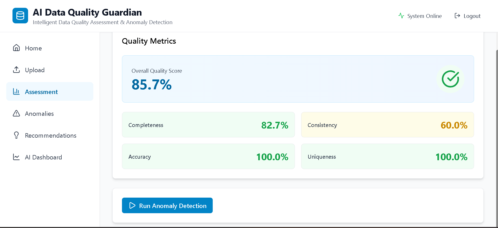
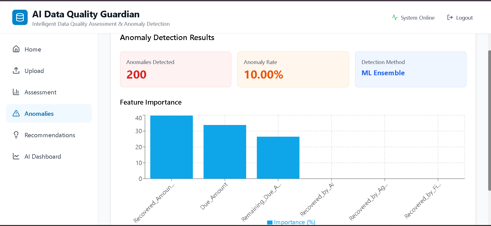
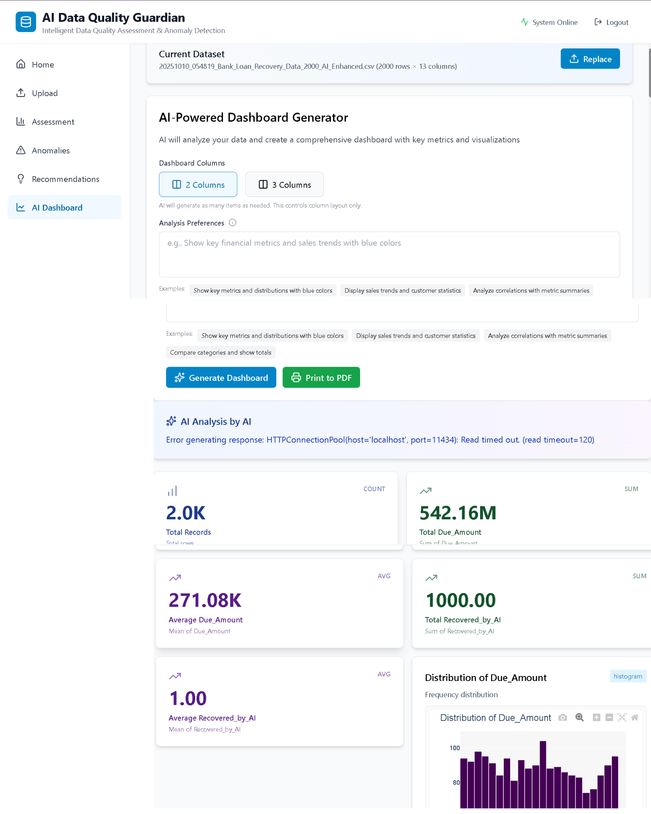
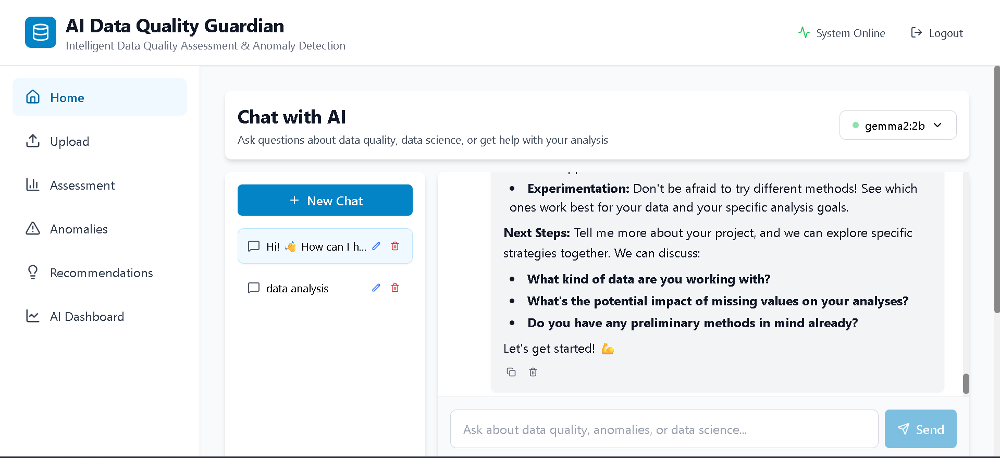

# AI Data Quality Guardian

An intelligent system for comprehensive data quality assessment, anomaly detection, and automated cleaning recommendations powered by local AI models.


## Features

###  Quality Assessment
Analyze completeness, consistency, accuracy, and uniqueness metrics across your datasets with comprehensive scoring.

###  Anomaly Detection
ML ensemble models (Isolation Forest, Local Outlier Factor, One-Class SVM) detect outliers and data quality issues automatically.

###  AI Recommendations
Get actionable cleaning strategies powered by Gemma 2:2b local LLM for data preprocessing and quality improvement.

###  AI Dashboard Generator
Gemma 2:2b analyzes your dataset and creates interactive dashboards with:
- Smart metric cards (count, sum, avg, min, max, median)
- 23+ chart types (histogram, scatter, heatmap, violin, 3D scatter, etc.)
- Natural language prompts for customization
- Browser-based PDF export

###  AI Chat Interface
Chat with Gemma 2:2b about data quality, data science concepts, and get help with analysis. Features:
- Multiple chat sessions
- Markdown rendering
- Message history persistence
- Copy/delete functionality

## Tech Stack

### Backend
- **FastAPI** - Modern Python web framework
- **SQLAlchemy** - ORM for database operations
- **Pandas** - Data manipulation and analysis
- **Scikit-learn** - ML models for anomaly detection
- **Plotly** - Interactive visualizations
- **Ollama + Gemma 2:2b** - Local LLM inference

### Frontend
- **React 18** - UI library
- **Tailwind CSS** - Styling
- **Zustand** - State management
- **React Query** - Server state management
- **Plotly.js** - Interactive charts
- **React Markdown** - Markdown rendering

### Database
- **PostgreSQL** - Production database
- **SQLite** - Development database

## Installation

### Prerequisites
- Python 3.11+
- Node.js 18+
- Ollama (for local LLM)

### 1. Clone Repository
```bash
git clone https://github.com/anandkaman/ai-data-quality
cd ai-data-quality-guardian
```


### 2. Backend Setup
```bash
cd backend

Create virtual environment
python -m venv venv

Activate virtual environment
Windows:
venv\Scripts\activate

Linux/Mac:
source venv/bin/activate

Install dependencies
pip install -r requirements.txt

Create database
python -m app.core.database

Run server
uvicorn app.main:app --reload
```
Backend runs at `http://localhost:8000`

            
### 3. Frontend Setup
```bash
cd frontend

Install dependencies
npm install

Run development server
npm run dev
```
Frontend runs at `http://localhost:5173`

### 4. Ollama Setup
```bash
Install Ollama from https://ollama.ai
Pull Gemma 2:2b model
ollama pull gemma2:2b

Verify model is running
ollama list
```


## Project Structure

```bash
ai-data-quality-guardian/
├── backend/
│ ├── app/
│ │ ├── api/
│ │ │ └── v1/
│ │ │ └── routes/
│ │ │ ├── auth.py
│ │ │ ├── upload.py
│ │ │ ├── assessment.py
│ │ │ ├── anomaly.py
│ │ │ ├── recommendations.py
│ │ │ ├── chat.py
│ │ │ └── ai_dashboard.py
│ │ ├── core/
│ │ │ ├── config.py
│ │ │ ├── database.py
│ │ │ └── security.py
│ │ ├── models/
│ │ │ ├── database_models.py
│ │ │ └── schemas.py
│ │ ├── services/
│ │ │ ├── quality_engine/
│ │ │ ├── anomaly_engine/
│ │ │ └── llm_engine/
│ │ └── main.py
│ ├── uploads/
│ ├── requirements.txt
│ └── .env
├── frontend/
│ ├── src/
│ │ ├── components/
│ │ │ └── layout/
│ │ ├── features/
│ │ │ ├── auth/
│ │ │ ├── upload/
│ │ │ ├── dashboard/
│ │ │ ├── recommendations/
│ │ │ └── chat/
│ │ ├── services/
│ │ ├── store/
│ │ └── App.jsx
│ ├── package.json
│ └── tailwind.config.js
├── .gitignore
├── README.md
└── LICENSE
```

## Usage

### 1. Upload Dataset
- Navigate to Upload page
- Drag and drop CSV/Excel file
- View dataset preview and basic statistics

### 2. Run Quality Assessment
- Go to Assessment page
- Click "Run Quality Assessment"
- View completeness, consistency, accuracy, and uniqueness scores
- Interactive progress tracker shows real-time processing

### 3. Detect Anomalies
- After assessment, click "Run Anomaly Detection"
- ML ensemble models analyze data
- View anomaly visualizations and statistics

### 4. Get Recommendations
- Click "Generate Recommendations"
- Gemma 2:2b analyzes quality issues
- Receive actionable cleaning strategies with code examples

### 5. Generate AI Dashboard
- Navigate to AI Dashboard page
- Upload dataset or use existing one
- Enter natural language prompt (optional)
- Select 2 or 3 column layout
- Click "Generate Dashboard"
- View metric cards and interactive charts
- Print to PDF using browser (Ctrl+P)

### 6. Chat with AI
- Go to Home page
- Start conversation in chat interface
- Create multiple chat sessions
- Ask about data quality, data science, or analysis help
- Copy/delete messages as needed

## API Documentation

FastAPI provides automatic interactive documentation:
- Swagger UI: `http://localhost:8000/docs`
- ReDoc: `http://localhost:8000/redoc`

## Configuration

### Backend Environment Variables
```bash
# ======================
# DATABASE Configuration
# ======================
DATABASE_URL=sqlite:///./data_quality.db

# ======================
# SECURITY Configuration
# ======================
SECRET_KEY=  # Change this to a strong random value in production
ACCESS_TOKEN_EXPIRE_MINUTES=10080
ALGORITHM=HS256

# ======================
# API Configuration
# ======================
API_V1_STR=/api/v1
PROJECT_NAME=AI Data Quality Guardian
DEBUG=True

# ======================
# CORS Configuration
# ======================
ALLOWED_ORIGINS=http://localhost:5173,http://127.0.0.1:5173

# ======================
# FILE UPLOAD Configuration
# ======================
UPLOAD_DIR=uploads
MAX_UPLOAD_SIZE=104857600
ALLOWED_EXTENSIONS=csv,xlsx,xls

# ======================
# OLLAMA/LLM Configuration "if you use switch or change the model make sure to keep 'OLLAMA_MODEL' empty.
# ======================
OLLAMA_BASE_URL=http://localhost:11434
OLLAMA_MODEL=gemma2:2b
OLLAMA_TIMEOUT=1000

# ======================
# CLEANUP Configuration
# ======================
CLEANUP_DAYS=1
CLEANUP_EMPTY_CHATS_DAYS=7

# ======================
# LOGGING Configuration
# ======================
LOG_LEVEL=INFO
```

# Generate a Secure SECRET_KEY
```bash
#Windows (PowerShell):

python -c "import secrets; print(secrets.token_urlsafe(32))"
```
```bash
#Linux/Mac:
python3 -c "import secrets; print(secrets.token_urlsafe(32))"
```

## Features in Detail

### Quality Metrics

**Completeness Score**
- Missing value percentage
- Column-level completeness analysis

**Consistency Score**
- Data type consistency
- Format pattern validation
- Duplicate detection

**Accuracy Score**
- Range validation
- Domain value checks
- Statistical outlier detection

**Uniqueness Score**
- Duplicate row analysis
- Primary key validation

### Anomaly Detection Models

**Isolation Forest**
- Efficient for high-dimensional data
- Detects global outliers

**Local Outlier Factor (LOF)**
- Identifies local density deviations
- Good for clustered data

**One-Class SVM**
- Robust to outliers
- Learns decision boundary

### AI Dashboard Chart Types

Supports 23+ chart types:
- Basic: histogram, scatter, bar, line, pie, box, violin
- Advanced: heatmap, 3D scatter, bubble, area
- Statistical: Q-Q plot, ECDF
- Hierarchical: sunburst, treemap, funnel, waterfall
- Multivariate: parallel coordinates, density contour

## Contributing

Contributions are welcome! Please follow these steps:

1. Fork the repository
2. Create feature branch (`git checkout -b feature/AmazingFeature`)
3. Commit changes (`git commit -m 'Add AmazingFeature'`)
4. Push to branch (`git push origin feature/AmazingFeature`)
5. Open Pull Request

## License

This project is licensed under the MIT License - see the [LICENSE](LICENSE) file for details.

## Acknowledgments

- **Gemma 2:2b** by Google for local LLM inference
- **Ollama** for easy LLM deployment
- **Plotly** for interactive visualizations
- **FastAPI** for modern Python web framework
- **React** ecosystem for frontend development

## Contact


Project Link: [https://github.com/anandkaman/ai-data-guardian](https://github.com/yourusername/ai-data-quality-guardian)

## Screenshots

### Quality Assessment Dashboard


### Anomaly Detection


### AI Dashboard Generator


### Chat Interface



### Admin Cleanup
```bash
# List old datasets
curl http://localhost:8000/api/v1/admin/datasets/old?days_old=1

# Run cleanup manually
curl -X POST http://localhost:8000/api/v1/admin/cleanup/all

# Or just datasets
curl -X POST http://localhost:8000/api/v1/admin/cleanup/datasets?days_old=1

# Test empty chats cleanup
curl -X POST http://localhost:8000/api/v1/admin/cleanup/empty-chats?days_old=7
```
## User to model inference 
```bash
User → Frontend (React) → Backend (FastAPI) → Database → Ollama → Model
      ↑ Multiple layers + conversation context + database queries
```
